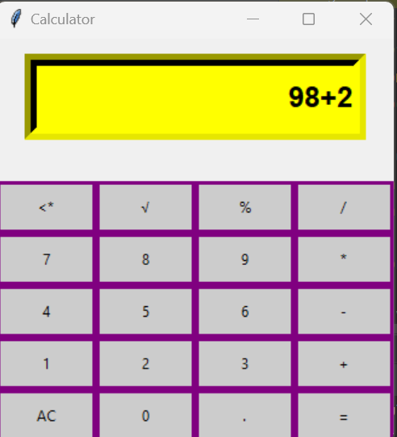

# CALCULATOR PROJECT 
This project gives basic calculator functionalities to end-user.

## Running
pip install - r requirements.txt

python codsoft_2.py

## Controls
(+) plus  - Addition

(-) minus  - Subtraction

(*) asterisk -  Multiplication

(/)  forward slash - Division

(=) Assignment - Equal

(%) modulus - percent 

(<*) clear - Remove a single number at a time

('\u221a') square root - Square Root

(AC) All Clear - Clear All

(.) Dot - Dot

## Current State

## Reference:
This project frameworks and modules refered from Online AI.

